# FrameForge Tutorial

FrameForge is dedicated for creating Frames and Beams, and apply operations (miter cuts, trim cuts) on these profiles.

## Create the skeleton

Beams are mapped onto Edges or ParametricLine (from a Sketch for instance)

For a start, we are going to create a simple frame.

1. In a new file, switch to the Frameforge workbench.

2. Create a sketch, and select orientation (XY for instance)

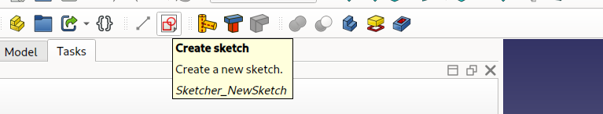

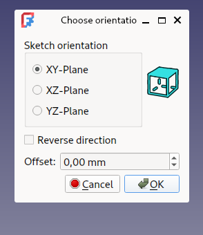

3. Draw a simple square in the sketch... it will be our skeleton

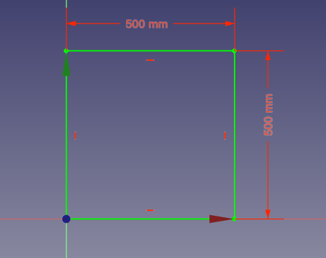

4. Close the Sketch edit mode.

## Create the frame

1. Launch the Profile tool.

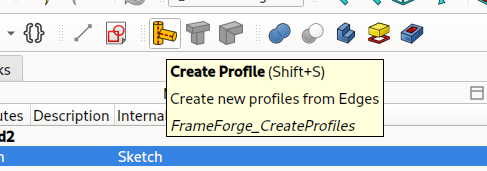

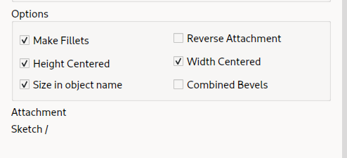

1. Select a profile from the lists (Material / Family / Size)

You can change the size just below the family, the tool has a lot of predefined profile, you can also change the parameters...

3. In the 3D View, select edges to apply the profile creation:

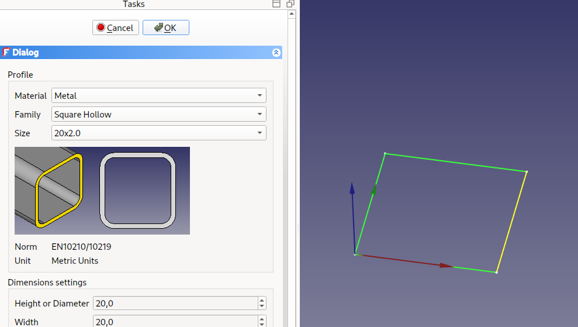

(You can also select the sketch in the view before launching the create profile tool, it will create profiles for all edges in the profiles)

1. And press OK in the Create Profile Task. Now, you have four profiles !

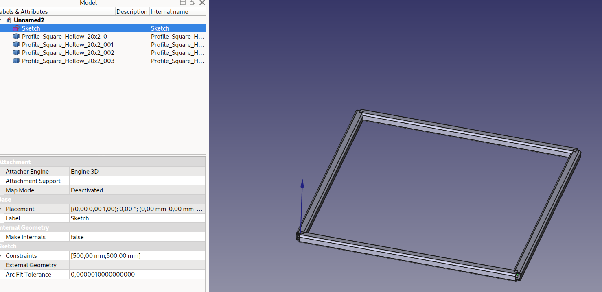

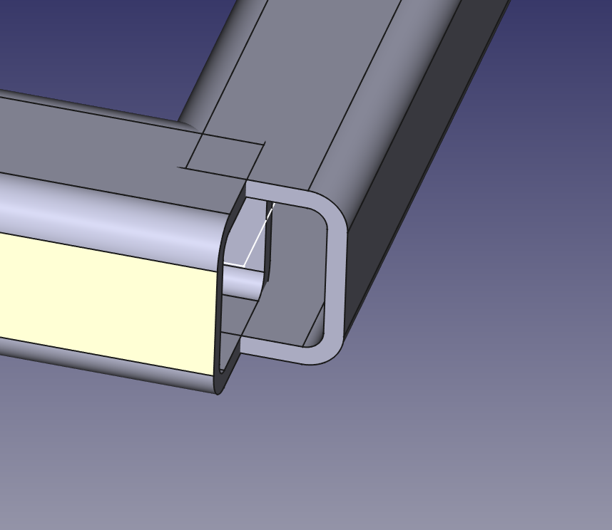

**And voila ! You have your first frame !**

You can add a Unit Price (per meter), it will be used into the BOM tool

## Going 3D... Making a cube !

We can build more complexe shapes, and there are severals ways of doing it.

### More Sketches !

We can add more sketches into our project:

1. Create a new Sketch
2. Select the same orientation as the previous one (XY)
3. Draw a square the same size and placement as the previous one.

4. Now, change the position of the sketch:

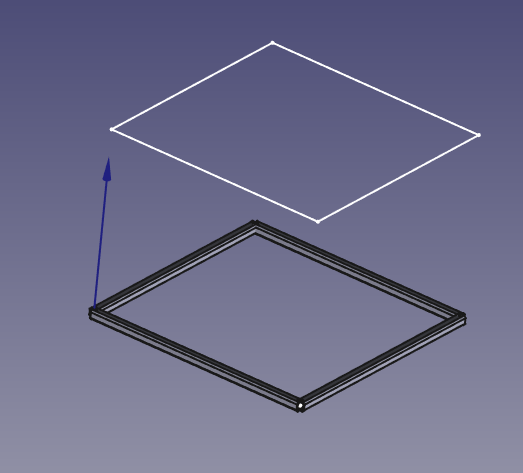

And the new sketch is 400mm on top of the first one !

You can therefore use Create Profile Command again to create another square frame !

### Parametric Line

You can create parametrics lines for joining two vertices (points), these lines can be used with Warehouse Profile as well...

1. one can hide profiles objects with [Space Bar] (it allows to see the sketches)

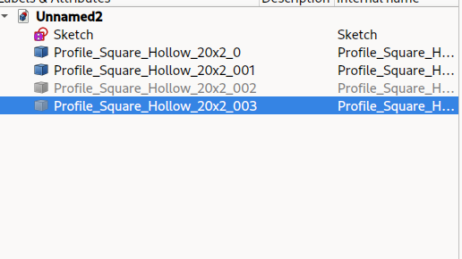

2. Selects vertices

3. Create Parametric Line

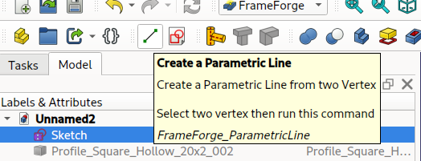

You can therefore use Create profile again to create the four vertical beams !

1. Open Create Profile, select the profile you want
2. Select the Parametric lines, click OK.

### More Sketches / Part2 !

There is another ways to add sketches, that allows to do more complicated stuff...

Sometime you want add a sketch to a specific place, and link it to another sketch. (If you modify the first Sketch, then the second will follow, hopefully)

This is not possible with the Position / Base Placement, that is an absolute position.

We are going to "Map" the sketch to something else.

1. Create a new Sketch, and set orientation to: YZ

I added a circle to the sketch so you can see where it is.. (just for reference !)

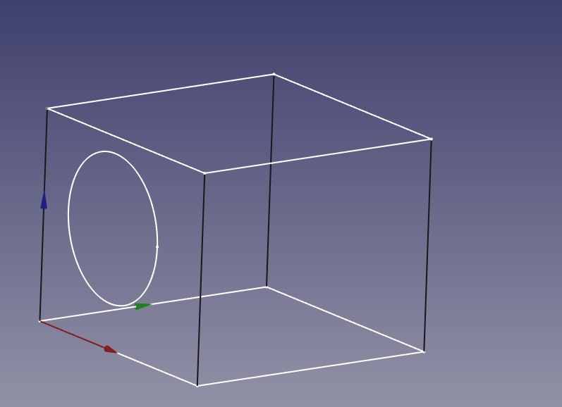

2. Click on the map mode property:

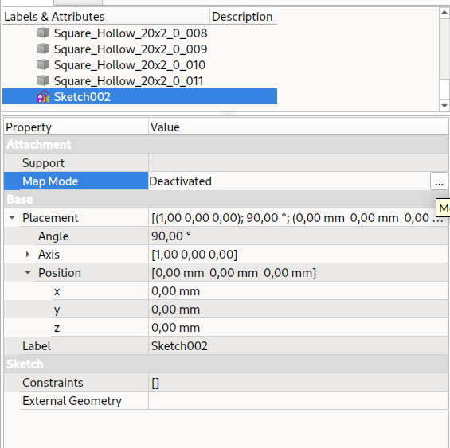

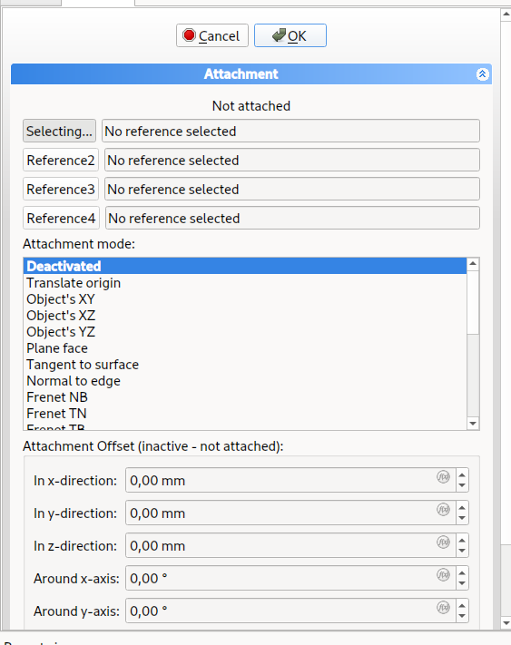

You can change the map mode, selecting faces, vertices and edges...

Here, our circle is in a new plan, the one at the top left of the screen...

There are a lot of options here.

You can then edit the sketch, and create more line and frames...

## Bevels and corners.

As you can see, the junctions are not that good (yet !). The profiles are centered on the skeleton, and stops right at the end of the edges.

We are going to make corners, and bevels. There are two methods for that.

### Via Bevels property

It is my favorite for simple frame..

Let's hide everything except the first frame we made...

1. Select one of the profile, and in the property section, go for Bevel Start/End Cut 1/2

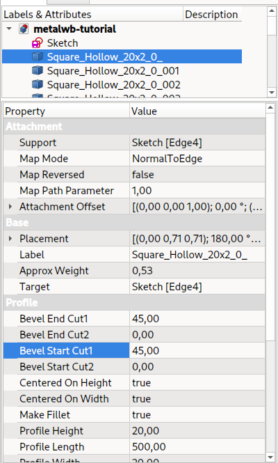

There are 4 entries (Start / End Cut1 Cut2)

That allows you to create bevels in the two axis, at the start or end of the profile.

Negative angles works, and must be used to compensate directions.

You can batch-modify that, by selecting all the profiles....

**And Voila ! a square frame !**

### Via End Miter Command

Let's show the other base frame ...

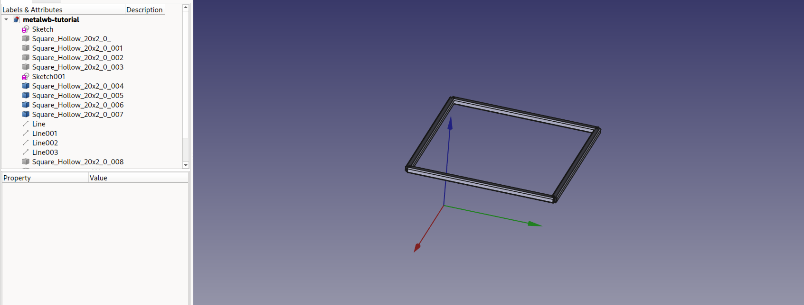

We first must add offsets to the existing profiles...  (offsets adds up to the dimension of the edge !)

1. add Offset (One profile by one, Or selecting all the profiles and change the offset.)

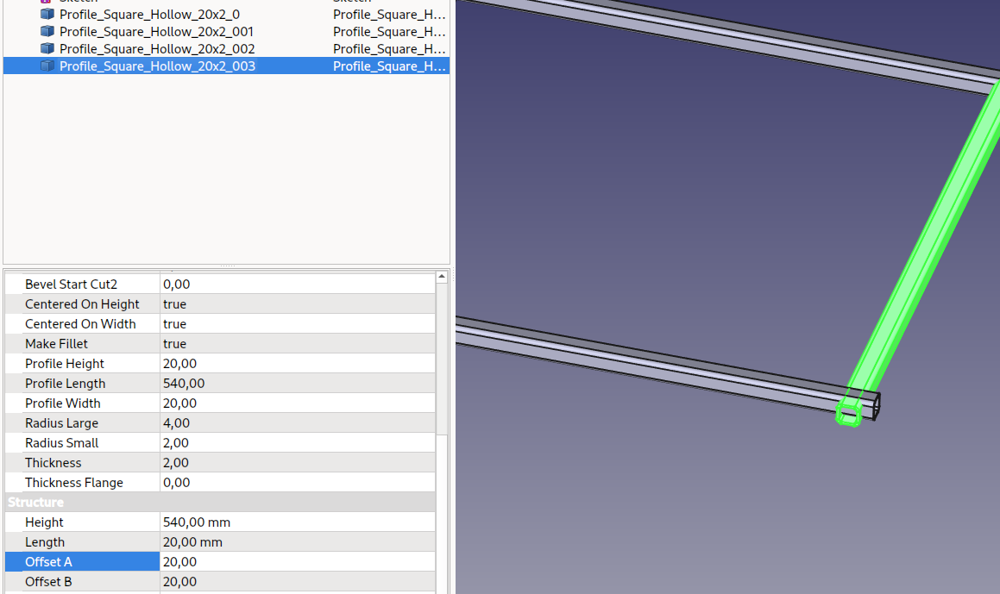

2. Unselect all objects, then select two touching Profiles. (**select faces in the 3D view, not objects in the tree view**)

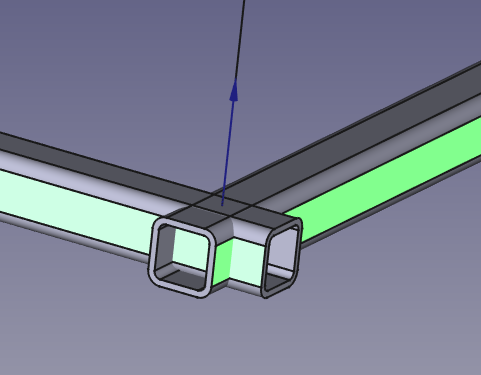

1. Click on the Create Miter End Command

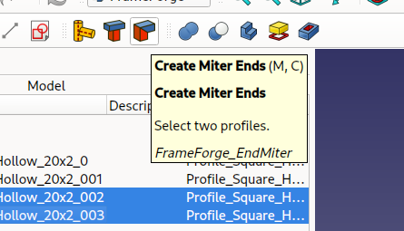

**And voila !** You have two "TrimmedProfile"

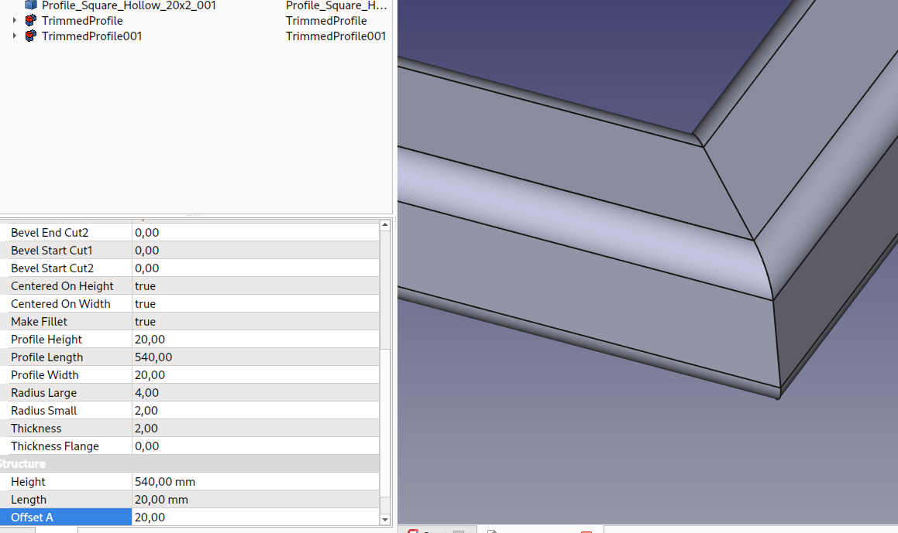

Do that again for others profiles of the top frame

### Via End Trim Command

Let's finish the 3 others corners of the second frame...

When everything is showed again, you can see the vertical profiles are not cut as they should...

Let's open again the corner manager, selecting "end trim"

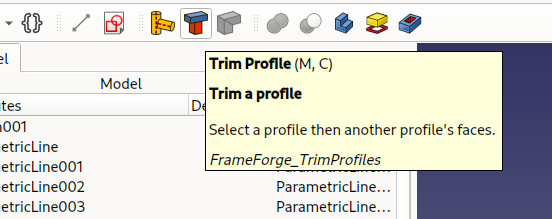

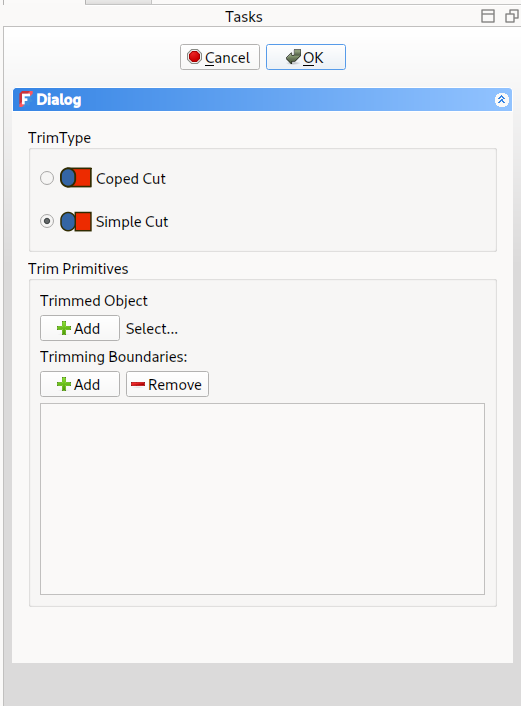

1. Select the vertical profile first, add it to the trimmed object with the plus (+) button

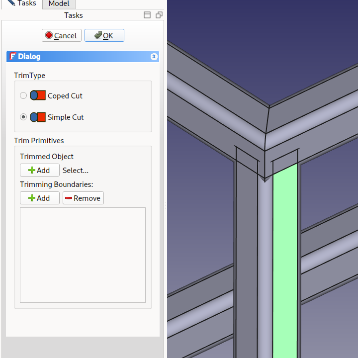

2. Select the face of the profile you want to cut with.. (here, I add to move the view and select the bottom **face**)

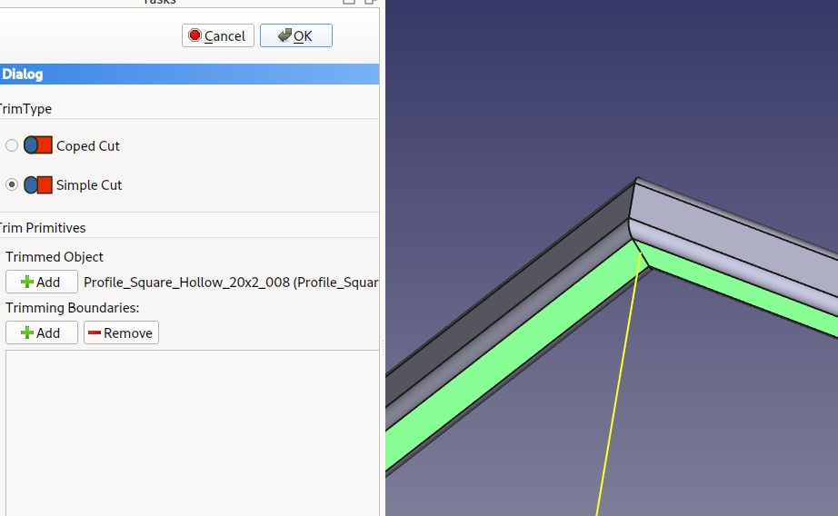
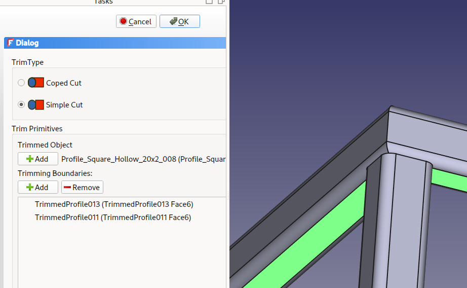

You can change the cut type: straight or following the other profile. (for notch) for instance

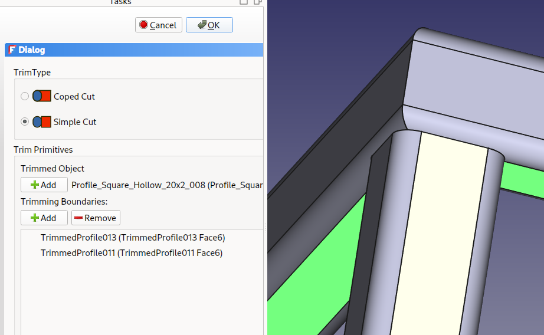
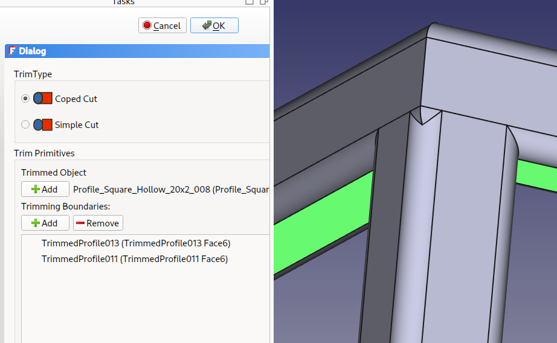

And you also can add faces related to the other side of the trimmed profile.

You can speed up your development process by first selecting the TrimmedObject, THEN the Trimming Boundaries (faces of profiles to cut with), then click on Trim Profile command; it will fill the "Trim Primitives"

## Organizing Objects

Now, you should have something like this:

You have Profiles, and TrimmedProfiles object (with two differents icons) TrimmedProfiles have Profiles or other TrimmedProfile as child.

There are three solutions to help organizing the project: (accessible from the frameforge toolbar)

- Part Container
- Fusion
- Group Container

My favorite is Part container because it is very close to the manufacturing process. each profile is a unique item that is manufactured, then assembled into a frame (the Part) then assembled into the full project. But you can keep "access" to the profile, as a specific part (cut, make holes...export to STEP, draw it)

The fusion, on the other way, will lock and "fuse" (well...) everything, making it hard to draw a 2D View for specific Profiles. (But for a long time it was the only way to cut and drill the profiles)

### Part Container

(My favorite solution)

I often use Part container for grouping profiles, sketches, etc.

You should drag only one object to the container... start by the first sketch, the rest should follow
... I don't know why, but FreeCAD is not happy about a group drag.

Sometime parts and profile get out of the Part Container. (mainly fixed now !)

It allows to group profiles, in a "light" way. profiles can be updated

### Fusion

One can fuse profiles together.

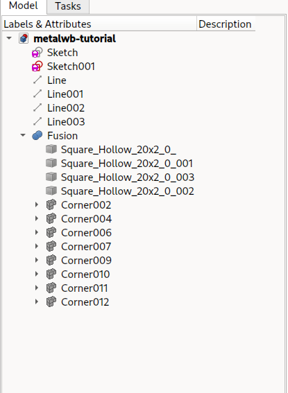

It allows to group profiles, in a "strong" way. profiles can be updated.

The fusion can be converted into a baseFeature allowing to be used into a Body (PartDesign) (extrude, etc)

**The profiles MUST BE "closed", without any crossed profiles.** The fusion tool need that. And the Body tool as well. Expect bugs if Profiles are not trimmed correctly.

#### Using the fusion in Part Design... ie, making holes !

To use all of these profiles in PartDesign, for instance, to make holes

you need to use a fusion of the profile, and create a body...

1. Drag and drop the fusion into the body.

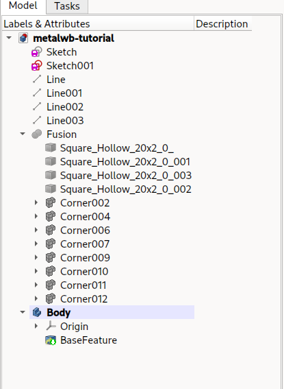

2. Now, you have a standard Part design Body...

You can map a sketch to any face, and use Part design to do whatever you want !

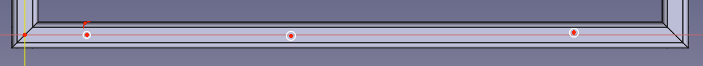

### Group Container

(my least prefered solution)

A group is just a folder. Simply add your objects into the Group. You are done. Can't be used in assembly for instance. 

## Cutout / Drill

It is possible to map a sketch to a face of a profile, then cutout / make pocket.

1. Select a face's profile and Click on the Sketch tool

A Dialog opens, keep it default (Attach to "Plane Face")

2. Defines the sketch, all sketch tool features works (external geometry too!)

3. Select the face, then the skecth in the 3D view and click on the Extruded Cutout

## Add Other elements to your design

Often, when building metallic frames, you will need to add laser-cut parts, or welded nut to your design.

It is adressed in Frameforge, via the "Link" command. 
Mainly it is a "App::Link" object, with an "Attachment" property.

The workflow is the following. 

You have a Part container with your Skeleton Skecths, and your profiles.
Create an object outside the Part, or in another part. (via Part, PartDesign, SheetMetal, whatever)

This is the reference object, that you can send to manufacturer, make nice 2D TechDraw, etc.

Add an object to yout design:
- Select the object in the Tree View
- Click on the "Attached Link" command in FrameForge toolbar.
- It will open the AttachementEditor Task (the same as FreeCAD internal attachement)
- You can then attach your Linked Part to what you want, via Vertexes and Edges of your base sketch.
- Validate the Task
- Then you got a Link to your part that is physically linked to your design.
- Manually move the Link into the Part Container (should be handled automatically)
- et voila ! You've added a Custom part into your design !

If you change the part (the original one) it will update the links automatically 
You can add several links of the same part.

You can add a "Price" property that will be added into the BOM

## Naming/Referencing your Profiles/Links.

When building bigger (> 20 Profiles) designs, it is handy to get ID of the Profiles.

It is addressed as well.

Profiles and FrameForge Links, when created, have an "ID" property, that is empty when the element is inserted.

You can use Populate ID and Reset ID to fill them automatically, regarding your selection and the existing design

Workflow:
- Select Profiles, Links, or Part Container/Fusion/Group.
- Click on "Populate IDs" command in FrameForge toolbar.
- The Populate ID Task opens, configure it the way you want:
    - Allow Duplicating IDs : Don't check for existing IDs inside the document

    - Reset Numbering IDs : reset IDs of selected Profiles/Links before renumbering it

    - IDs numbering type : "All Numbers" / "All Letters" / "Number for profiles, letters for Links", "Letters for profiles, Number for links"

    - IDs numbering scheme : 
        - Fill when available (inside selection)
        - Fill when available (whole document)
        - Start at current document numbering
        - Start at specific number/letter

    - First Number ID
    - First Letter ID

Validate, and voila !

You can also reset the existing document 's IDs with the "Reset IDs" Command

## Create Balloons inside TechDraw

That has been a must have for a LOOONG time !

This tool allows you to create/update Balloons inside a TechDraw View for all Links/Profiles.
(It was so long and error-prone to do it manually !)

Workflow:
- Create a TechDraw Page
- Insert a View with Profiles, Links, Part Container of Profiles and Links

- In the TreeView, select
    - The TechDraw View to fill with balloons. (the View, not a View Group !)
    - All the links and profiles to create balloons for.

- Click on the "Create Balloons" Command in FrameForge toolbar.

Et voila! you've got the balloons, with their arrow pointing at the center of the parts ! 
(you still have to move the balloon itself where you want)

The Balloons are annotated with the Profile/Link ID.

If you change the design, (dimensions) just select the balloons in the TreeView, and launch the "Resfresh Balloons" Command, 
It will update arrow positions and labels accordingly.

## BOM Tool

Another fancy tool is the BOM tool.

You've spend several hours (days ?) to make a nice design, you still have to write the BOM/CutList. That is slow, and error prone.

Just use the BOM tool ! Select the Part Container/Profiles/Links to be taken into account and click on the "Create BOM" Command

It will create a BOM SpreadSheet, and a CutList SpreadSheet.

The BOM contains the Profiles, with their Cut angles, Quantity, Length, Material, ID, Price, Weigth.
It also can contains all the Links, ie the LaserCut Parts for instance.

If selected, you can also create a CutList, **sorted to optimize your work** at the saw.
- Add Kerf and Stock Length.

About Angles:
- If the Object is a Profile, the tool uses BevelsCut A/B - X/Y ("- / *" symbol for same direction cut or 90° rotated cut)
- If the Object is a TrimmedProfile, the tool calculate the angle (angle prefix with "@" symbol)
- If a TrimmedProfile is Perfect Cut (Notch) is is noted "P"

Check your BOM for error !
